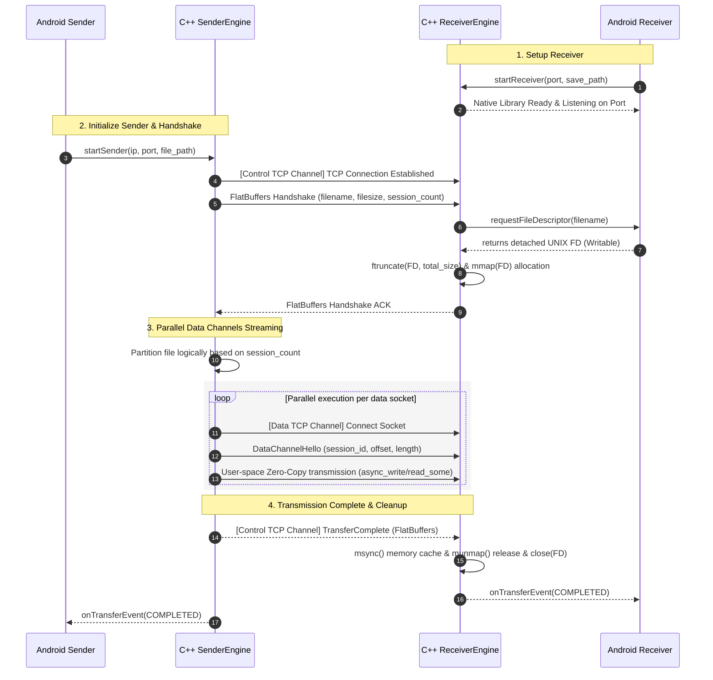
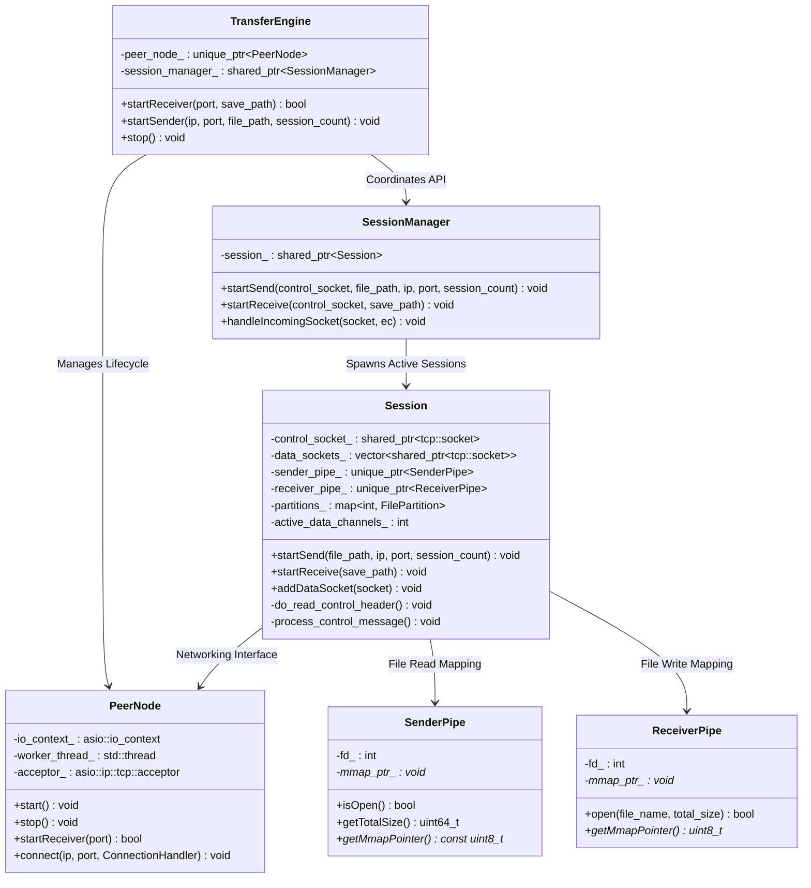
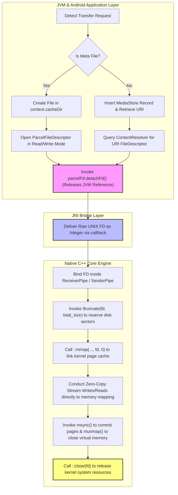
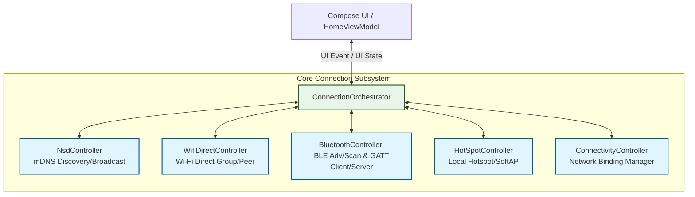
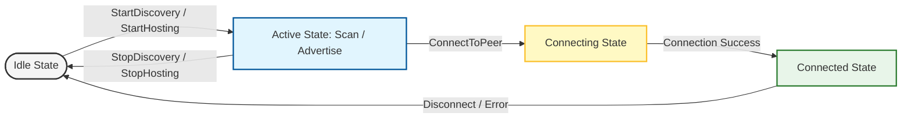
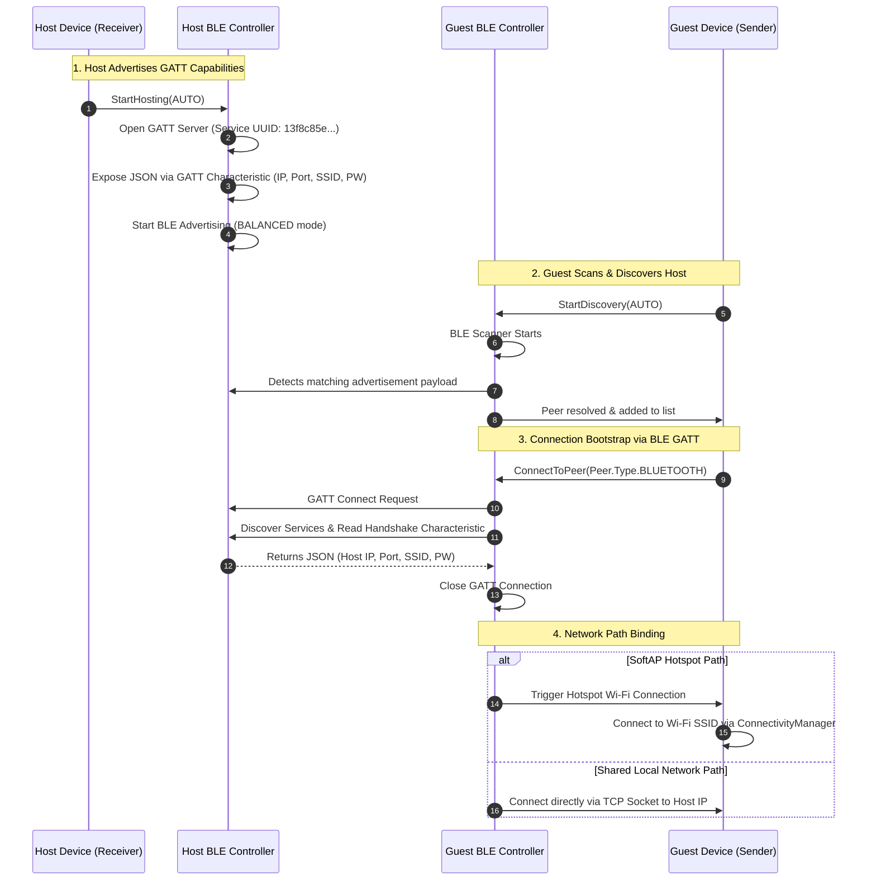

# Peer-to-Peer File Transfer System

Transfer is a high-performance, low-latency, peer-to-peer (P2P) file transfer solution. It relies on a high-speed C++ Native Core bridged to a Kotlin-based Android application via Java Native Interface (JNI). 

The platform leverages user-space Zero-Copy mechanics via memory mapping (`mmap`) and asynchronous network I/O to achieve near-line-rate transmission speeds. It also abstracts complex multi-protocol discovery (Wi-Fi Direct, NSD/mDNS, BLE GATT, and SoftAP) behind a unified Connection Orchestration layer.

---

## Table of Contents
1. [Overall System Architecture](#1-overall-system-architecture)
2. [Core Transfer Protocol and Workflow](#2-core-transfer-protocol-and-workflow)
3. [Native C++ Core Engine](#3-native-c-core-engine)
   - [3.1. Directory Structure](#31-directory-structure)
   - [3.2. Class Architecture and Dependency Diagrams](#32-class-architecture-and-dependency-diagrams)
   - [3.3. Session Recovery (Resume) Protocol & UNIX File Descriptor Lifecycle](#33-session-recovery-resume-protocol--unix-file-descriptor-lifecycle)
4. [Android Application Architecture](#4-android-application-architecture)
   - [4.1. Directory Structure](#41-directory-structure)
   - [4.2. Scanning and Connection Orchestration Subsystem](#42-scanning-and-connection-orchestration-subsystem)
   - [4.3. Unidirectional Data Flow (UDF) State Machine Transitions](#43-unidirectional-data-flow-udf-state-machine-transitions)
   - [4.4. Bootstrapping Protocol (BLE GATT Exchange)](#44-bootstrapping-protocol-ble-gatt-exchange)
   - [4.5. High-Speed Storage Access Layer (Scoped Storage Bypass)](#45-high-speed-storage-access-layer-scoped-storage-bypass)

---

## 1. Overall System Architecture

The system is logically partitioned into a Kotlin-based Android Application Layer and a Native C++ Core Engine Layer. Interaction between these layers is managed strictly through a JNI Bridge.

```
┌─────────────────────────────────────────────────────────────┐
│                      Android App (Kotlin)                   │
│   ┌─────────────────────────────────────────────────────┐   │
│   │            Jetpack Compose Presentation (UI)        │   │
│   └──────────────────────────┬──────────────────────────┘   │
│                              ▼                              │
│   ┌─────────────────────────────────────────────────────┐   │
│   │           Domain Layer (UseCases & Models)          │   │
│   └──────────────────────────┬──────────────────────────┘   │
│                              ▼                              │
│   ┌─────────────────────────────────────────────────────┐   │
│   │  Data Layer (Repositories, ConnectionOrchestrator)  │   │
│   └──────────────────────────┬──────────────────────────┘   │
└──────────────────────────────┼──────────────────────────────┘
                               │ (JNI Bridge)
┌──────────────────────────────▼──────────────────────────────┐
│                    C++ Native Core Engine                   │
│   ┌─────────────────────────────────────────────────────┐   │
│   │          TransferEngine Facade (Session Mngr)       │   │
│   └──────────────────────────┬──────────────────────────┘   │
│                              ▼                              │
│   ┌──────────────────────────┴──────────────────────────┐   │
│   │    Boost ASIO TCP Networking & mmap Zero-Copy File   │   │
│   └─────────────────────────────────────────────────────┘   │
└─────────────────────────────────────────────────────────────┘
```

- **Android App Layer**: Follows Clean Architecture and Unidirectional Data Flow (UDF/MVI) patterns. It manages hardware peripherals, system permissions, and coordinates diverse discovery protocols.
- **C++ Native Core Engine**: Handles low-level multi-channel socket I/O using **Boost ASIO**. By implementing memory-mapped file access (`mmap`), the engine eliminates intermediate data copying between user and kernel space, minimizing CPU overhead and context switching.

---

## 2. Core Transfer Protocol and Workflow

The system utilizes a split-channel design, isolating control signals from high-speed raw data streaming.



### Protocol Mechanics
1. **Control/Data Separation**: The Control Channel processes low-frequency metadata using **FlatBuffers** serialization (`MessageType_Handshake`, `MessageType_HandshakeAck`, `MessageType_TransferComplete`, `MessageType_Error`).
2. **Logical Partitioning**: The Sender divides files into logical boundaries (`session_count`) to saturate the network interface bandwidth via parallel TCP streams.
3. **User-Space Zero-Copy**: Instead of allocating heap arrays (e.g., `std::vector`) and invoking copying socket APIs, the core engine memory-maps files directly into its address space. Boost ASIO streams write and read directly from these virtual memory addresses.

---

## 3. Native C++ Core Engine

### 3.1. Directory Structure

The C++ Core Engine is compiled as a static library for core capabilities, with a separate JNI bridging target for Android.

```
cpp/
├── CMakeLists.txt              # Root build script defining external dependencies (ASIO, FlatBuffers)
├── core/
│   ├── CMakeLists.txt          # Configuration for static core library build
│   ├── include/
│   │   ├── Logger.hpp          # Platform-specific unified logging macros (Android Logcat vs Desktop)
│   │   ├── PeerNode.hpp        # Low-level Boost ASIO socket acceptor and connector
│   │   ├── ReceiverPipe.hpp    # Handles physical file writes via write-configured mmap
│   │   ├── SenderPipe.hpp      # Handles physical file reads via read-configured mmap
│   │   ├── Session.hpp         # Orchestrates control message loops and parallel data lanes
│   │   ├── SessionManager.hpp  # Manages and maps active transfer sessions
│   │   ├── TransferEngine.hpp  # High-level entry point facade exposed to wrapper layers
│   │   └── Types.hpp           # Enumerations, structural definitions, and callbacks
│   └── src/
│       ├── PeerNode.cpp
│       ├── ReceiverPipe.cpp
│       ├── SenderPipe.cpp
│       ├── Session.cpp
│       ├── SessionManager.cpp
│       └── TransferEngine.cpp
└── android/
    ├── CMakeLists.txt          # Target configuration for runtime shared JNI library (libtransfer_jni.so)
    └── TransferWrapperJni.cpp  # JNI bindings, thread detachment, and JVM callback delegations
```

---

### 3.2. Class Architecture and Dependency Diagrams

Below is the design of class dependencies and structural boundaries inside the C++ Core Engine:



#### Engine Design Principles
- **Asynchronous Execution Context**: `PeerNode` encapsulates a single `asio::io_context` running on a dedicated POSIX thread (`worker_thread_`). This isolates all low-level TCP events from JVM threads.
- **Unified Session State**: `SessionManager` ensures only one transaction runs at any given time, preventing race conditions over local system and socket resources.
- **Resource Cleanup**: Sockets are owned via `std::shared_ptr` to ensure clean object lifetimes during asynchronous write callbacks.

---

### 3.3. Session Recovery (Resume) Protocol & UNIX File Descriptor Lifecycle

To handle network dropouts and comply with restrictive OS sandboxing, the engine implements a metadata-driven recovery protocol alongside a decoupled file descriptor lifecycle.

#### 3.3.1. Session Recovery (Resume) Mechanics
- Upon starting a receiver session, the Android layer initializes a tracking schema file with a `.meta` extension (e.g., `video.mp4.meta`) inside the application's secure cache directory (`context.cacheDir`).
- The C++ Core maps this metadata file using memory mapping. It records the progress, offsets, and bytes successfully verified by each logical partition.
- During re-connection, the receiver parses the `.meta` file to find the last verified byte boundary. This offset is transmitted to the sender during the initial control handshake. The sender then offsets its file mapping pointer, avoiding redundant data transfer.

#### 3.3.2. UNIX File Descriptor Lifecycle Flowchart

The flowchart below traces the transition of file descriptor ownership from Android's virtual JVM space down to Native C++ kernel allocation:



---

## 4. Android Application Architecture

### 4.1. Directory Structure

The Android Application Layer utilizes Clean Architecture paradigms, organizing packages to isolate external platforms from core domain logic.

```
android/app/src/main/java/io/goodmidnight/transfer/
├── Application.kt              # Application subclass managing dependency graphs (Hilt)
├── core/
│   ├── base/                   # Base classes for MVI / Unidirectional Data Flow architectures
│   ├── connection/             # Multi-protocol scanning and P2P connection logic
│   │   ├── bluetooth/          # BLE GATT Client/Server bootstrapping implementation
│   │   ├── connectivity/       # Network routing and socket interface binding
│   │   ├── hotspot/            # Local SoftAP Hotspot control layer
│   │   ├── nsd/                # Network Service Discovery (mDNS) implementation
│   │   ├── wifidirect/         # Wi-Fi Direct (P2P) Group Owner/Client controllers
│   │   └── ConnectionOrchestrator.kt  # Unified facade coordinating discovery streams
│   └── transfer/               # Android Service orchestrating runtime JNI sessions
├── data/
│   ├── datasource/             # Interface abstractions for local system files and preferences
│   ├── di/                     # Dependency Injection modules (Dagger Hilt)
│   ├── jni/
│   │   └── TransferEngine.kt   # JNI bridge declaration singleton
│   └── repository/             # Transforms asynchronous JNI events into cold Kotlin Flows
├── domain/                     # Platform-independent enterprise rules and logic
│   ├── model/
│   ├── repository/
│   └── usecase/
└── ui/                         # Presentation Layer
    ├── core/                   # UI Design system tokens and composable themes
    └── feature/
        └── transfer/           # Jetpack Compose features (Transfer Progress, QR Codes, Peer Selection)
```

---

### 4.2. Scanning and Connection Orchestration Subsystem

The connection subsystem utilizes a centralized hub to merge results from multiple physical scan layers.



`ConnectionOrchestrator` merges reactive updates using Kotlin Coroutines (`combine`). It aggregates lists of available nodes into a single, deduplicated `discoveredPeers` flow, simplifying downstream consumption by presentation layers.

---

### 4.3. Unidirectional Data Flow (UDF) State Machine Transitions

All active scan controllers (`NsdController`, `WifiDirectController`, and `BluetoothController`) inherit from `BaseController<State, Event, Effect, Exception>`, following a unified lifecycle state machine to manage P2P connections:



#### Lifecycle State Descriptions
- **Idle State**: The default initial state where peripherals are powered down, and no active scanning, advertising, or connection bindings are present.
- **Active State (Scanning/Advertising)**: The controller is actively conducting hardware operations.
  - *NsdController*: Running `discoverServices` or broadcasting via `registerService`.
  - *WifiDirectController*: Triggering `discoverPeers` or establishing a Group Owner network.
  - *BluetoothController*: Scanning LE bands for targeted service UUIDs or serving the GATT profile via `BluetoothLeAdvertiser`.
- **Connecting State**: Initiated upon matching a remote node. The client establishes physical handshake protocols (Gatt Service Resolution, Wi-Fi Direct socket handshakes).
- **Connected State**: The connection path is successfully validated. The controller yields a `ConnectionEstablished` (or `HandshakeCompleted`) effect to notify the `ConnectionOrchestrator` to initialize socket streaming.


---

### 4.4. Bootstrapping Protocol (BLE GATT Exchange)

To minimize connection overhead, Bluetooth Low Energy (BLE) serves as an out-of-band bootstrapping channel to exchange network configuration before launching socket connections.



---

### 4.5. High-Speed Storage Access Layer (Scoped Storage Bypass)

Android 10+ Scoped Storage prevents native C++ file operations using direct file paths. To allow `mmap` functionality, the system uses a decoupled file descriptor passing mechanism.

```
┌─────────────────────────────────────────────────────────────────────────────┐
│                             Android App (Kotlin)                            │
│                                                                             │
│ 1. C++ Core requests file access: requestFileDescriptor(fileName)           │
│                                                                             │
│ 2. Insert record into MediaStore.Downloads to create a target entry:        │
│    val uri = resolver.insert(MediaStore.Downloads.EXTERNAL_CONTENT_URI, ...)│
│                                                                             │
│ 3. Retrieve system descriptor in Read/Write mode:                           │
│    val parcelFd = resolver.openFileDescriptor(uri, "rw")                    │
│                                                                             │
│ 4. Decouple JVM tracking and return raw integer UNIX descriptor:             │
│    return parcelFd.detachFd()                                               │
└──────────────────────────────────────┬──────────────────────────────────────┘
                                       │ (Return Raw UNIX FD - Integer)
┌──────────────────────────────────────▼──────────────────────────────────────┐
│                            C++ Core Engine (Native)                         │
│                                                                             │
│ 5. Bind integer FD to virtual memory subsystem:                             │
│    mmap_ptr_ = ::mmap(nullptr, total_size, PROT_WRITE, MAP_SHARED, fd, 0)   │
│                                                                             │
│ 6. Conduct direct streaming I/O from network sockets to mapped page cache:  │
│    socket->async_read_some(asio::buffer(mmap_ptr_ + offset, size), ...)      │
└─────────────────────────────────────────────────────────────────────────────┘
```

#### Key Architecture Patterns
- **Descriptor Detachment**: `detachFd()` transfers descriptor ownership from the JVM garbage collector directly to the Native OS kernel. Sockets and files remain mapped until explicitly closed by the C++ engine (`::close(fd)`).
- **Early Space Reservation**: `ReceiverPipe` invokes `::ftruncate` on the file descriptor immediately after mapping. This reserves sector allocation on the physical storage device, preventing disk fragmentation and runtime writing out-of-bounds errors.
